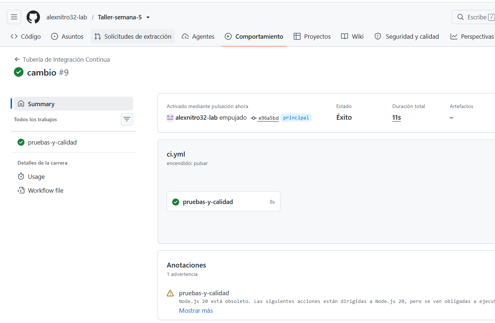
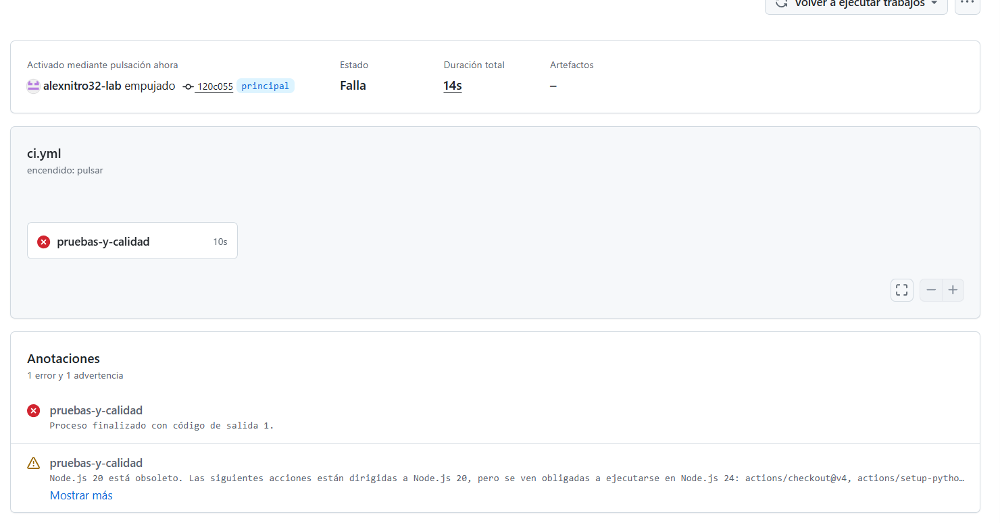
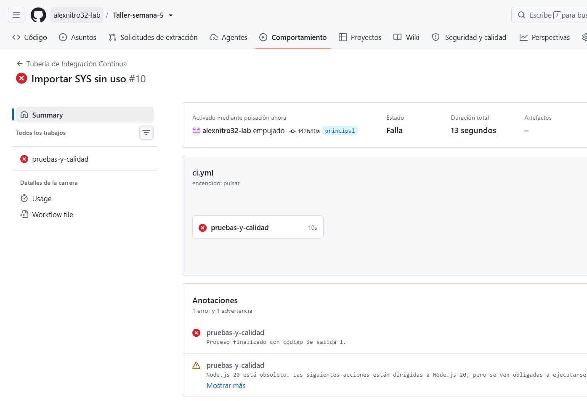

# Taller Semana 5: El Pipeline que nunca se escribió 
## Sistema de Integración Continua (CI) para Reposición de Inventario

Este repositorio contiene la implementación de un sistema de **Integración Continua (CI)** de nivel profesional utilizando **GitHub Actions**, desarrollado para automatizar el control de calidad, análisis sintáctico (Lifting) y pruebas de regresión de la lógica de negocio de reposición de inventario de nuestra cadena de tiendas.

---

## Analogía del Restaurante: ¿Cómo funciona este Pipeline?

Para comprender el flujo, imaginemos este sistema como la cocina de un restaurante de alta gama:
1. **La Cocina Vacía (El Servidor/Runner):** Cada vez que se sube un cambio (`push`), GitHub alquila un espacio de cocina totalmente limpio y vacío (`ubuntu-latest`).
2. **La Receta (Checkout):** El inspector de calidad copia las hojas de la receta de inventario y las coloca sobre la mesa (`actions/checkout@v4`). Sin este paso, el chef no sabría qué cocinar.
3. **La Estufa (Setup Python):** El inspector instala la estufa profesional y el gas licuado con la versión exacta requerida (`actions/setup-python@v5` con Python 3.12).
4. **Utensilios e Ingredientes (Install Requirements):** Se descargan las herramientas de medición exactas (`pytest` y `ruff`) especificadas en nuestro manifiesto de ingredientes (`requirements.txt`).
5. **Pase de Limpieza (Linter con Ruff):** El inspector pasa un paño blanco por la mesa para asegurarse de que no haya desorden, código innecesario o variables huérfanas. Si la cocina está sucia, se detiene el servicio.
6. **Prueba de Sabor (Testing con Pytest):** Se prepara la receta de prueba y se saborea. Si cumple exactamente con los estándares lógicos definidos en los `assert`, la receta es aprobada y se le otorga el sello verde.

---

##  Explicación de los 5 Pasos del Workflow (`ci.yml`)

El pipeline se encuentra configurado de manera declarativa en `.github/workflows/ci.yml` y ejecuta la siguiente secuencia cronológica en la nube:

1. **`actions/checkout@v4` (Traer el código):** Clona nuestro repositorio dentro del servidor virtual de GitHub Actions para que los comandos subsiguientes tengan acceso físico a los archivos de código (`src/`) y pruebas (`tests/`).
2. **`actions/setup-python@v5` (Configurar Python):** Configura un entorno aislado de ejecución ejecutando Python en su versión estable `3.12` para garantizar el principio de reproducibilidad y consistencia tecnológica.
3. **Instalación de Dependencias (`pip install`):** Actualiza el administrador de paquetes `pip` e instala de forma hermética las versiones de producción de `pytest==9.1.1` y `ruff==0.14.0` listadas en `requirements.txt`.
4. **Inspección de Limpieza con Ruff (`ruff check .`):** Analiza estáticamente el código fuente en busca de malas prácticas, importaciones inútiles, variables declaradas sin uso o violaciones sintácticas al estándar PEP 8.
5. **Pruebas Unitarias con Pytest (`pytest`):** Ejecuta de forma automática los 5 tests lógicos del negocio para certificar que ningún cambio altere o rompa el cálculo matemático de reposición de inventario.

---

##  Bitácora de Pruebas: Evidencia del Pipeline en Acción

A continuación se presentan los registros visuales de las tres fases por las que cruzó el pipeline para demostrar la efectividad del "guardián" de producción:

### 🟢 1. Pipeline Exitoso (Success / Verde)
*El código cumple con todas las validaciones de formato de Ruff y pasa los 5 tests unitarios de Pytest de manera impecable.*



---

### 🔴 2. Fallo Detectado por Pytest (Rojo - Bug Matemático)
*Para esta simulación, introdujimos un bug crítico en `src/inventario.py` cambiando el operador de división (`/`) por multiplicación (`*`). El pipeline en la nube se detuvo de inmediato en el paso de pruebas, impidiendo que el código defectuoso continuara hacia producción.*



---

### 🔴 3. Fallo Detectado por Ruff (Rojo - Código Sucio)
*Para esta simulación, restauramos la división correcta pero ensuciamos el archivo importando una librería no utilizada (`import sys` en la cabecera). El linter estricto Ruff detectó la importación basura y cortó el avance del pipeline en el Paso 4.*



## Guía de Ejecución Local

Para reproducir localmente estas auditorías de calidad antes de subir un commit, sigue estas instrucciones desde tu terminal activa en la raíz del proyecto:

1. **Crear e inicializar el entorno virtual aislado:**
   ```bash
   python -m venv .venv
   source .venv/bin/activate  # En Windows (PowerShell): .venv\Scripts\Activate.ps1
   ```
2. **Instalar los paquetes requeridos:**
   ```bash
   pip install -r requirements.txt
   ```
3. **Correr el linter (Ruff) en busca de desorden:**
   ```bash
   python -m ruff check .
   ```
4. **Ejecutar la batería de pruebas lógicas (Pytest):**
   ```bash
   python -m pytest
   ```

---

## La Defensa: Pregunta de Calificación de DataOps

> **"Si tu compañero sube un Pull Request con un test que falla, ¿qué pasa exactamente, y por qué eso protege el proyecto?"**

**Respuesta:**
Cuando se sube un Pull Request (PR), el trigger `pull_request` en `ci.yml` se dispara automáticamente. GitHub Actions monta un contenedor Ubuntu temporal, descarga el código propuesto y ejecuta secuencialmente los pasos del workflow. Al llegar al paso `python -m pytest`, la prueba fallará provocando un código de salida distinto de cero (`exit code 1`). 

Esto de inmediato:
1. Marca el pipeline con un estado de **Fallo (Cruz Roja ❌)** en la pestaña del PR de GitHub.
2. Bloquea de forma automática la posibilidad de fusionar (`merge`) esa rama en la rama sagrada `main`.
3. Evita la contaminación de la base de código estable con errores de regresión que podrían dejar a nuestras más de mil sucursales desabastecidas o sin cálculo de reposición en producción. Protege el negocio deteniendo el error en la puerta.
